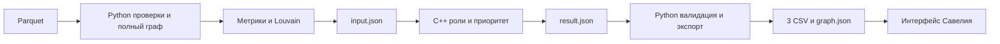

# HackAlem TALENTS — граф денежных переводов

Помогает аналитику выбрать, кого проверять первым в сети денежных переводов:
очередь клиентов, гипотезы ролей, численные объяснения и следующие действия.
Выводы учитывают неполноту выгрузки и требуют проверки человеком.

Арман: данные, кластеры и интеграция. Артур: аналитическое ядро C++17. Савелий: интерфейс.
Parquet → проверки/метрики/Louvain → C++ → три CSV и graph.json → веб-интерфейс.

Текущее состояние: аналитический пайплайн и интерфейс работают на полном датасете.
[Документация](docs/README.md) · [Измеренная польза](docs/EVIDENCE.md) · [Задачи команды](team/LAST_80_MINUTES.md) · [Демо](frontend/DEMO.md).

## Структура репозитория

| Путь | Назначение |
|---|---|
| `TechTask/` | Исходное ТЗ, данные и стартер организаторов |
| `engine/` | Ядро C++, его контракт, схемы и тесты |
| `hackalem/`, корневые `*.py`, `tests/` | Python-пайплайн, подготовка и проверка выгрузок |
| `frontend/` | Веб-интерфейс и полный пакет в `public/data/` |
| `examples/` | Маленькие примеры для интеграции |
| `team/` | Текущие задания и материалы участников |
| `docs/` | Навигация, результаты эксперимента и архив прежних проверок |

## Проверяемый результат

На полном графе **2248 клиентов и 3119 связей** сравнили две стратегии отбора
top-1/3/5/10. При виртуальном исключении 10 клиентов по нашему приоритету
крупнейшая компонента уменьшается **1877 → 1420**, по простому обороту —
**1877 → 1502**. Выбор по обороту охватывает больше исторической суммы.
Методика, все числа и команда воспроизведения: [эксперимент](docs/EVIDENCE.md).
Это сравнение структуры наблюдаемой сети; точность выявления нарушений не измерена.

**Версии:** C++ и готовый пакет `frontend/public/data` — **1.3.0**.
Полный пересчёт Армана с проверкой доставки прошёл за **5,660 с**:
43 теста C++, 333 Python без пропусков, 34 UI-теста; прежние роли, оценки и
три CSV сохранены. Baseline и восемь сценариев сверены независимо.
[SHA, время и результаты поставки](team/arman/RESILIENCE_CHECK.md).
Экран устойчивости подключён: N=1/3/5/10, priority/volume, до/после и переход
к исходным карточкам; работа на полном пакете проверена в браузере.

## Запуск интерфейса на готовых данных

Полный набор Армана уже включён в frontend/public/data. Для просмотра достаточно Node.js 22.14+ и npm:

```powershell
cd frontend
npm ci
npm run dev
```

Открыть http://localhost:5173. На экране — топ-20, направленный граф, поиск точного gid, фильтры, карточка с ограничениями и следующими действиями, суммы выбранных связей и экспорт трёх CSV. Для просмотра не нужны Python, компилятор, аккаунт или внешний API.

Проверки UI: `npm test`, сборка: `npm run build`. Запуск сборки: `npm run preview` (http://localhost:4173). [Подробная инструкция](frontend/README.md), [проверка интерфейса](docs/archive/frontend/VERIFICATION.md), [демо на пять минут](frontend/DEMO.md).

Полный комплект результатов для проверки и подключения UI:
[frontend/public/data/](frontend/README.md). В нём все 2248 узлов, 88 кластеров,
топ-20, полный graph.json и отчёты проверки.

Текущая приёмка UI: 34 теста и production-сборка прошли на пакете 1.3.0;
публичные файлы свежей сборки проверены побайтово по HTTP.
История проверок конкретных версий собрана в [архиве](docs/README.md#архив-проверок-и-завершённых-задач).

## Установка и сборка

Нужны Python 3.12, CMake >=3.16 и C++17-компилятор. JSON-библиотека уже в репозитории. Установка Python-пакетов требует PyPI или заранее подготовленных wheels; пересчёт работает без сети.

```powershell
py -3.12 -m venv .venv
.\.venv\Scripts\Activate.ps1
python -m pip install -r requirements.txt
cmake -S engine -B engine/build -DCMAKE_BUILD_TYPE=Release
cmake --build engine/build --config Release --parallel 2
```

На Linux/macOS используйте `python3.12` и `source .venv/bin/activate`. На Windows можно вместо двух команд CMake выполнить `powershell -ExecutionPolicy Bypass -File engine/build.ps1`, если компилятор установлен через CLion или доступен в PATH. Подробности: [engine/README.md](engine/README.md).

Дополнительные переменные окружения, `.env`, аккаунты и API-ключи не нужны.
Все пути в примерах задаются относительно корня репозитория. Результаты содержат
обезличенные gid; внешнее обогащение данных не используется.

## Один запуск

Из корня репозитория после установки зависимостей и сборки:

```powershell
python pipeline.py
```

Пайплайн автоматически находит `engine/build/engine.exe`, `engine/build/Release/engine.exe` либо `engine/build/engine`. Данные по умолчанию: `TechTask/data(1)/data`; результаты: `out/`.

Явные пути и конфигурация:

```powershell
python pipeline.py --core engine/build/engine.exe --data "TechTask/data(1)/data" --out out
python pipeline.py --core engine/build/engine.exe --core-config overrides.json --top 50 --out out-custom
python pipeline.py --prepare-only --out prepared
```

`--core-config` передаётся ядру как `--config`; для этой выборки сохраняйте max_depth=4. В режиме prepare-only создаются input.json и validation.json, ядро не вызывается. Используйте отдельный каталог.

Для разработки без компилятора доступен отдельный `python pipeline.py --demo --out out-demo`. Это Python demo-эвристика, не расчёт C++ Артура: `meta.is_demo=true`, `engine=python-demo-v1`. Автоматического переключения на неё при ошибке C++ нет.

## Передача данных интерфейсу

Готовый набор настоящего C++ 1.3.0 находится в [`frontend/public/data/`](frontend/public/data/). Все 2248 клиентов получили `next_actions`, которые показаны в карточках; в meta сохранён проверенный `resilience`. Интерфейс Савелия использует URL — `/data/graph.json`, `/data/nodes_roles.csv`, `/data/clusters.csv`, `/data/top_nodes.csv`. Запуск: cd frontend, npm ci, npm run dev.

Пересчитать и проверить этот набор одной командой:

```powershell
python prepare_ui_data.py
```

Без пересчёта проверить хэши и согласованность уже переданного набора:

```powershell
python verify_outputs.py
```

Команда требует все шесть файлов передачи (три CSV, graph.json, validation.json, run_manifest.json), а также input/result как подтверждение исходных значений. Проверяет состав узлов, топ, поля C++, внутренние суммы и хэши, включая validation.json. По умолчанию отклоняет Python-demo. Для сверки с файлами Parquet и используемым бинарником добавить `--data "TechTask/data(1)/data" --core engine/build/engine.exe`.

Файлы набора хранятся в Git без преобразования переводов строк благодаря .gitattributes, поэтому хэши работают после checkout на Windows и Linux. Автоматическое текстовое слияние этих файлов отключено: оно может продублировать JSON-ключи. При конфликте пересчитайте весь комплект через `prepare_ui_data.py` и проверьте его; не соединяйте фрагменты вручную. Логи с локальными путями не включены в Git. После нового расчёта сохраняйте весь набор вместе, не смешивайте файлы разных прогонов.

При запущенном интерфейсе можно проверить выдачу файлов тем же сервером Vite:

```powershell
# Из корня репозитория во втором терминале, пока работает npm run dev:
python verify_outputs.py --base-url http://127.0.0.1:5173/data
```

Эта команда сверяет файлы по HTTP; поиск, граф и карточки проверяются в самом
интерфейсе. UI перед показом сверяет SHA-256 graph.json и трёх CSV с manifest;
экспорт использует сохранённые байты открытого расчёта. Подробности —
[frontend/README.md](frontend/README.md). Арман завершил проверку: новая копия
`9e5eff6` с новыми venv, сборкой и node_modules затем обновлена tracked-файлами
до `859b33f`, после объединения UI проверен `2e2f385`; затронутые проверки
повторены. Это последовательное обновление чистой базы; зависимости заново
на каждом коммите не устанавливались. Подробности —
[FINAL_RUN.md](team/arman/FINAL_RUN.md), команды —
[REPRODUCIBILITY.md](team/arman/REPRODUCIBILITY.md). Для защиты подготовлен
[разбор данных и кластеров](team/arman/DATA_AND_CLUSTERS.md).

## Результаты и интерфейс

| Файл | Содержимое |
|---|---|
| input.json | Все узлы, плоские метрики, cluster_id, направленные рёбра |
| result.json | Неизменённый ответ C++ с дополнительными признаками и объяснениями |
| nodes_roles.csv | gid, role, role_score, cluster_id, priority_score, evidence |
| clusters.csv | cluster_id, n_nodes, n_seed, sum_kzt_internal, top_gids, hypothesis |
| top_nodes.csv | rank, gid, role, priority_score, why |
| graph.json | Плоские узлы для UI, рёбра с id, кластеры, топ, конфигурация и ограничения |
| validation.json | Проверки данных, счётчики и предупреждения |
| run_manifest.json | Версии, хэши исходных данных/ядра/артефактов, конфигурация и время |
| core.stdout.log, core.stderr.log | Логи успешного запуска ядра |

Схема UI описана в [CONTRACT.md](CONTRACT.md). Формат C++: [engine/CONTRACT.md](engine/CONTRACT.md), [схема входа](engine/schemas/input.schema.json), [схема результата](engine/schemas/result.schema.json). Исходный пример для Савелия: [team/saveliy/graph.example.json](team/saveliy/graph.example.json); примеры Python-интеграции: [examples/](examples/).

В graph.json сохранены `features`, `warnings`, `role_candidates`, `priority_breakdown`, `next_actions` и `meta.config` ядра. Роли, оценки и следующие действия Python не меняет. Топ упорядочивается по точному priority_score, затем числовому gid; первые 20 сверяются с C++. В JSON все gid/src/dst — строки канонического int64. Не использовать JavaScript Number для идентификаторов.

CSV — UTF-8, запятая, стандартное экранирование, ровно обязательные колонки. top_gids — JSON-массив строк внутри ячейки; при чтении используйте `dtype={"gid": str}`. На полном датасете топ содержит минимум 20 узлов, на маленьком тестовом — все доступные.

## Данные и метрики

Сохранён поток исходного starter.py: load, sanity_check, build_graph, basic_features. Проверяются уникальность gid и направленных пар, наличие концов рёбер, канонический int64 без промежуточного float, типы, глубины, конечные положительные суммы. Транзакции агрегируются по src/dst: число совпадает точно, суммы — с абсолютным допуском 0.01 KZT без относительного допуска. Одинаковые строки переводов не удаляются: без transaction_id нельзя доказать дубликат.

Перед добавлением рёбер в DiGraph добавляются все узлы, включая изолированные. Метрики: in/out_deg, in/out_kzt, in/out_tx, PageRank (sum_kzt, alpha=0.85, tol=1e-10, max_iter=1000), pass_through=out_kzt/in_kzt либо null при нулевом входе. Изолированные участвуют в PageRank. Дополнительные флаги Python и копия метрик в `metrics` сохранены для совместимости demo; канонические поля C++ и UI находятся на верхнем уровне узла.

## Louvain

Неориентированная проекция: `w({u,v})=sum_kzt(u→v)+sum_kzt(v→u)`. Петли исключаются только из кластеризации. Изолированные вершины проекции получают собственный кластер. Seed=42, resolution=1.0; порядок вставки отсортирован, версии библиотек фиксированы. cluster_id упорядочены по минимальному строковому gid сообщества и могут измениться при изменении входа.

Внутренний оборот кластера — сумма исходных направленных рёбер с обоими концами в кластере, включая петли, каждое ребро один раз. top_gids — до пяти лидеров по приоритету. Гипотезы кластеров не устанавливают общего организатора.

Назначение кластера описывается в `hypothesis` по основным ролям участников,
с фактическими количествами. Порядок выбора: отсутствие связей → все узлы на
depth=4 → сочетание consolidator и distributor → coordinator → consolidator →
distributor → transit → terminal → назначение не определено. Первые два случая
оставляют назначение неопределённым; остальные формулируются как гипотезы сбора,
распределения, связи ветвей, транзита или получения. При наличии seed и depth=4
добавляются их количества и ограничения наблюдения. Эти тексты не меняют роли,
оценки или разбиение на кластеры.

## Роли, приоритет и ограничения

Формальные пороги, порядок выбора ролей, формулы силы признаков и приоритета документированы Артуром в [engine/README.md](engine/README.md); настройки: [engine/config/default.json](engine/config/default.json). Пайплайн принимает результат без повторного скоринга и сохраняет фактически применённую конфигурацию. role_score не является вероятностью виновности.

Depth=4 означает обрыв наблюдений, входящие seed неполны. Доступны только внутрибанковские переводы за июль 2026 от 5000 KZT; внешние потоки и полные остатки неизвестны. Отношение сумм и достижимость не доказывают движение одних и тех же денег. Все роли и сообщества — гипотезы для аналитика. Изолированность и метка peripheral не означают отсутствие риска.

## Проверки и ошибки

Проверяются JSON Schema результата, версия, полный набор уникальных gid, совпадение cluster_id, допустимые роли, оценки 0–1, evidence/why, топ ядра. `terminal` при depth=4 без исходящих отклоняется. Результаты соединяются по gid, не по позиции массива.

Общий таймаут 300 секунд включает запуск дочернего Python, чтение, расчёт, C++ и экспорт; таймаут ядра 120 секунд. Установка и компиляция выполняются заранее. Ошибка возвращает ненулевой код, превышение общего бюджета — 124. Новый result создаётся в уникальной временной папке, поэтому старый ответ не может подменить результат.

До публикации ошибка сохраняет прежние выгрузки. Публикация выполняется по одному файлу, manifest — последним; это не атомарная замена всего каталога. Потребитель может проверить хэши. Не запускайте два процесса с одинаковым `--out`; после неуспеха нельзя принимать старые файлы за новый успешный прогон.

```powershell
python -m pip install -r requirements-dev.txt
python -m pytest -q
python engine/tests/test_engine.py engine/build/engine.exe -v
python make_examples.py --core engine/build/engine.exe
```

Тесты охватывают ID, суммы, количества, изолированные узлы, границу глубины, проекцию, ошибочные ответы, сортировку и экспорт. Реальные интеграционные тесты требуют предварительно собранного ядра; без него явно пропускаются. Контрольный отчёт Артура: [engine/VALIDATION.md](docs/archive/engine/VALIDATION.md).

Коммит `c7f7bb4` также проверен после нового клонирования, установки зависимостей
в пустое venv и сборки C++ с нуля: [отчёт воспроизводимости](docs/archive/engine/CLEAN_CHECK.md).

### Основной сценарий самостоятельной проверки

1. Установить зависимости и собрать ядро по разделу выше.
2. Выполнить `python pipeline.py`: получить в `out/` полный комплект результатов.
3. Для автоматической проверки схем, всех gid, приоритетов, кластеров и хэшей
   выполнить после установки `requirements-dev.txt`:

   ```powershell
   python engine/tests/check_pipeline.py engine/build/engine.exe
   ```

   Для Visual Studio путь — `engine/build/Release/engine.exe`, для Linux/macOS —
   `engine/build/engine`. Проверка сама выполняет новый расчёт в отдельном каталоге
   `engine/test-output/pipeline-integration/` и создаёт `integration-report.json`.
4. Ожидаемый результат: `status=passed`, 2248 узлов, 3119 рёбер, 19 изолированных
   узлов, 88 кластеров, пустые failures и warnings. Три CSV содержат 2248, 88
   и 20 строк данных соответственно; `run_manifest.json` содержит `demo=false`.
5. В результате найти gid из [контрольных случаев](team/DEMO_CASES.md), сверить
   роль, evidence, ограничения и вклады приоритета. Команды открытия и проверки UI находятся в frontend/README.md; результаты браузерной проверки — в [архиве проверок UI](docs/archive/frontend/VERIFICATION.md).

Синтетические CSV из `examples/` не заменяют полные выгрузки для сдачи.

## Архитектура



## Масштабирование до миллиона узлов

Заменить Python-объекты NetworkX на CSR/igraph/NetworKit либо C++, агрегировать транзакции потоково через Arrow/DuckDB, использовать масштабируемый Louvain/Leiden. Заменить полную материализацию JSON на Arrow/Parquet или потоковый обмен. UI загружает агрегаты сообществ и окрестности по запросу. Для большого числа seed использовать распространение битовых наборов по конденсации компонент или приближённые счётчики. Ограничение 5 минут на новом объёме требует отдельного замера.

## Команда

- [Артур — ядро C++ и устойчивость сети](team/artur/LAST_80_MINUTES.md)
- [Арман — данные и интеграция](team/arman/README.md)
- [Савелий — интерфейс](team/saveliy/README.md)

Исходные данные, ТЗ и неизменённый стартер находятся в TechTask/.

Сторонние компоненты, материалы организаторов и использование AI при разработке
раскрыты в [THIRD_PARTY.md](THIRD_PARTY.md).
