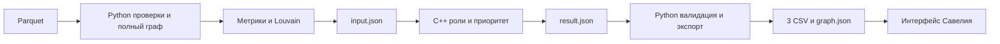

# HackAlem TALENTS — граф денежных переводов

Арман: данные, кластеры и интеграция. Артур: аналитическое ядро C++17. Савелий: интерфейс. Python использует стартер организаторов и действующий контракт Артура: Parquet → проверки/метрики/Louvain → C++ → три CSV и graph.json.

## Установка и сборка

Нужны Python 3.12, CMake >=3.16 и C++17-компилятор. JSON-библиотека уже в репозитории. Установка Python-пакетов требует PyPI или заранее подготовленных wheels; пересчёт работает без сети.

```powershell
py -3.12 -m venv .venv
.\.venv\Scripts\Activate.ps1
python -m pip install -r requirements.txt
cmake -S engine -B engine/build -DCMAKE_BUILD_TYPE=Release
cmake --build engine/build --config Release --parallel 2
```

На Linux/macOS используйте `python3.12` и `source .venv/bin/activate`. На Windows можно вместо двух команд CMake выполнить `powershell -ExecutionPolicy Bypass -File engine/build.ps1`, если компилятор установлен через CLion или доступен в PATH. Подробности: [engine/README.md](engine/README.md).

## Один запуск

Из корня репозитория после установки зависимостей и сборки:

```powershell
python pipeline.py
```

Пайплайн автоматически находит `engine/build/engine.exe`, `engine/build/Release/engine.exe` либо `engine/build/engine`. Данные по умолчанию: `TechTask/data(1)/data`; результаты: `out/`.

Явные пути и конфигурация:

```powershell
python pipeline.py --core engine/build/engine.exe --data "TechTask/data(1)/data" --out out
python pipeline.py --core engine/build/engine.exe --core-config overrides.json --top 50 --out out-custom
python pipeline.py --prepare-only --out prepared
```

`--core-config` передаётся ядру как `--config`; для этой выборки сохраняйте max_depth=4. В режиме prepare-only создаются input.json и validation.json, ядро не вызывается. Используйте отдельный каталог.

Для разработки без компилятора доступен отдельный `python pipeline.py --demo --out out-demo`. Это Python demo-эвристика, не расчёт C++ Артура: `meta.is_demo=true`, `engine=python-demo-v1`. Автоматического переключения на неё при ошибке C++ нет.

## Результаты и интерфейс

| Файл | Содержимое |
|---|---|
| input.json | Все узлы, плоские метрики, cluster_id, направленные рёбра |
| result.json | Неизменённый ответ C++ с дополнительными признаками и объяснениями |
| nodes_roles.csv | gid, role, role_score, cluster_id, priority_score, evidence |
| clusters.csv | cluster_id, n_nodes, n_seed, sum_kzt_internal, top_gids, hypothesis |
| top_nodes.csv | rank, gid, role, priority_score, why |
| graph.json | Плоские узлы для UI, рёбра с id, кластеры, топ, конфигурация и ограничения |
| validation.json | Проверки данных, счётчики и предупреждения |
| run_manifest.json | Версии, хэши исходных данных/ядра/артефактов, конфигурация и время |
| core.stdout.log, core.stderr.log | Логи успешного запуска ядра |

Схема UI описана в [CONTRACT.md](CONTRACT.md). Формат C++: [engine/CONTRACT.md](engine/CONTRACT.md), [схема входа](engine/schemas/input.schema.json), [схема результата](engine/schemas/result.schema.json). Исходный пример для Савелия: [team/saveliy/graph.example.json](team/saveliy/graph.example.json); примеры Python-интеграции: [examples/](examples/).

В graph.json сохранены `features`, `warnings`, `role_candidates`, `priority_breakdown` и `meta.config` ядра. Роли и оценки Python не меняет. Топ упорядочивается по точному priority_score, затем числовому gid; первые 20 сверяются с C++. В JSON все gid/src/dst — строки канонического int64. Не использовать JavaScript Number для идентификаторов.

CSV — UTF-8, запятая, стандартное экранирование, ровно обязательные колонки. top_gids — JSON-массив строк внутри ячейки; при чтении используйте `dtype={"gid": str}`. На полном датасете топ содержит минимум 20 узлов, на маленьком тестовом — все доступные.

## Данные и метрики

Сохранён поток исходного starter.py: load, sanity_check, build_graph, basic_features. Проверяются уникальность gid и направленных пар, наличие концов рёбер, канонический int64 без промежуточного float, типы, глубины, конечные положительные суммы. Транзакции агрегируются по src/dst: число совпадает точно, суммы — с абсолютным допуском 0.01 KZT без относительного допуска. Одинаковые строки переводов не удаляются: без transaction_id нельзя доказать дубликат.

Перед добавлением рёбер в DiGraph добавляются все узлы, включая изолированные. Метрики: in/out_deg, in/out_kzt, in/out_tx, PageRank (sum_kzt, alpha=0.85, tol=1e-10, max_iter=1000), pass_through=out_kzt/in_kzt либо null при нулевом входе. Изолированные участвуют в PageRank. Дополнительные флаги Python и копия метрик в `metrics` сохранены для совместимости demo; канонические поля C++ и UI находятся на верхнем уровне узла.

## Louvain

Неориентированная проекция: `w({u,v})=sum_kzt(u→v)+sum_kzt(v→u)`. Петли исключаются только из кластеризации. Изолированные вершины проекции получают собственный кластер. Seed=42, resolution=1.0; порядок вставки отсортирован, версии библиотек фиксированы. cluster_id упорядочены по минимальному строковому gid сообщества и могут измениться при изменении входа.

Внутренний оборот кластера — сумма исходных направленных рёбер с обоими концами в кластере, включая петли, каждое ребро один раз. top_gids — до пяти лидеров по приоритету. Гипотезы кластеров не устанавливают общего организатора.

## Роли, приоритет и ограничения

Формальные пороги, порядок выбора ролей, формулы силы признаков и приоритета документированы Артуром в [engine/README.md](engine/README.md); настройки: [engine/config/default.json](engine/config/default.json). Пайплайн принимает результат без повторного скоринга и сохраняет фактически применённую конфигурацию. role_score не является вероятностью виновности.

Depth=4 означает обрыв наблюдений, входящие seed неполны. Доступны только внутрибанковские переводы за июль 2026 от 5000 KZT; внешние потоки и полные остатки неизвестны. Отношение сумм и достижимость не доказывают движение одних и тех же денег. Все роли и сообщества — гипотезы для аналитика. Изолированность и метка peripheral не означают отсутствие риска.

## Проверки и ошибки

Проверяются JSON Schema результата, версия, полный набор уникальных gid, совпадение cluster_id, допустимые роли, оценки 0–1, evidence/why, топ ядра. `terminal` при depth=4 без исходящих отклоняется. Результаты соединяются по gid, не по позиции массива.

Общий таймаут 300 секунд включает запуск дочернего Python, чтение, расчёт, C++ и экспорт; таймаут ядра 120 секунд. Установка и компиляция выполняются заранее. Ошибка возвращает ненулевой код, превышение общего бюджета — 124. Новый result создаётся в уникальной временной папке, поэтому старый ответ не может подменить результат.

До публикации ошибка сохраняет прежние выгрузки. Публикация выполняется по одному файлу, manifest — последним; это не атомарная замена всего каталога. Потребитель может проверить хэши. Не запускайте два процесса с одинаковым `--out`; после неуспеха нельзя принимать старые файлы за новый успешный прогон.

```powershell
python -m pip install -r requirements-dev.txt
python -m pytest -q
python engine/tests/test_engine.py engine/build/engine.exe -v
python make_examples.py --core engine/build/engine.exe
```

Тесты охватывают ID, суммы, количества, изолированные узлы, границу глубины, проекцию, ошибочные ответы, сортировку и экспорт. Реальные интеграционные тесты требуют предварительно собранного ядра; без него явно пропускаются. Контрольный отчёт Артура: [engine/VALIDATION.md](engine/VALIDATION.md).

## Архитектура



## Масштабирование до миллиона узлов

Заменить Python-объекты NetworkX на CSR/igraph/NetworKit либо C++, агрегировать транзакции потоково через Arrow/DuckDB, использовать масштабируемый Louvain/Leiden. Заменить полную материализацию JSON на Arrow/Parquet или потоковый обмен. UI загружает агрегаты сообществ и окрестности по запросу. Для большого числа seed использовать распространение битовых наборов по конденсации компонент или приближённые счётчики. Ограничение 5 минут на новом объёме требует отдельного замера.

## Команда

- [Артур — следующие действия](team/Artur.md)
- [Арман — данные и интеграция](team/arman/README.md)
- [Савелий — интерфейс](team/saveliy/README.md)

Исходные данные, ТЗ и неизменённый стартер находятся в TechTask/.
